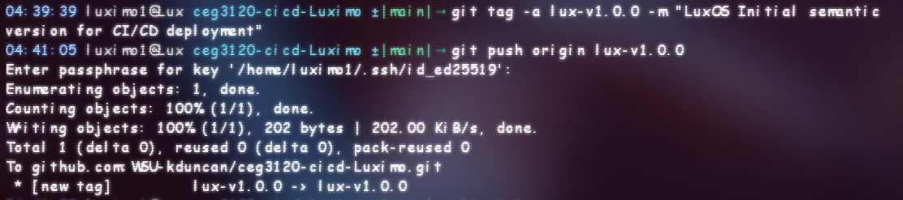
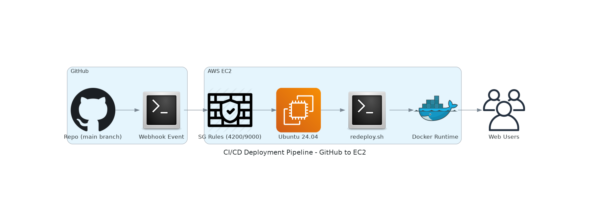
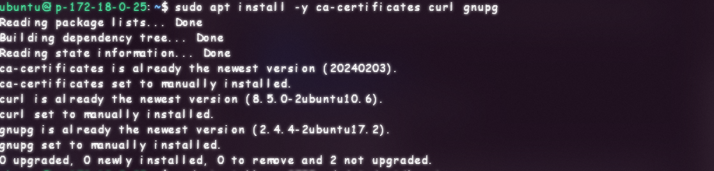
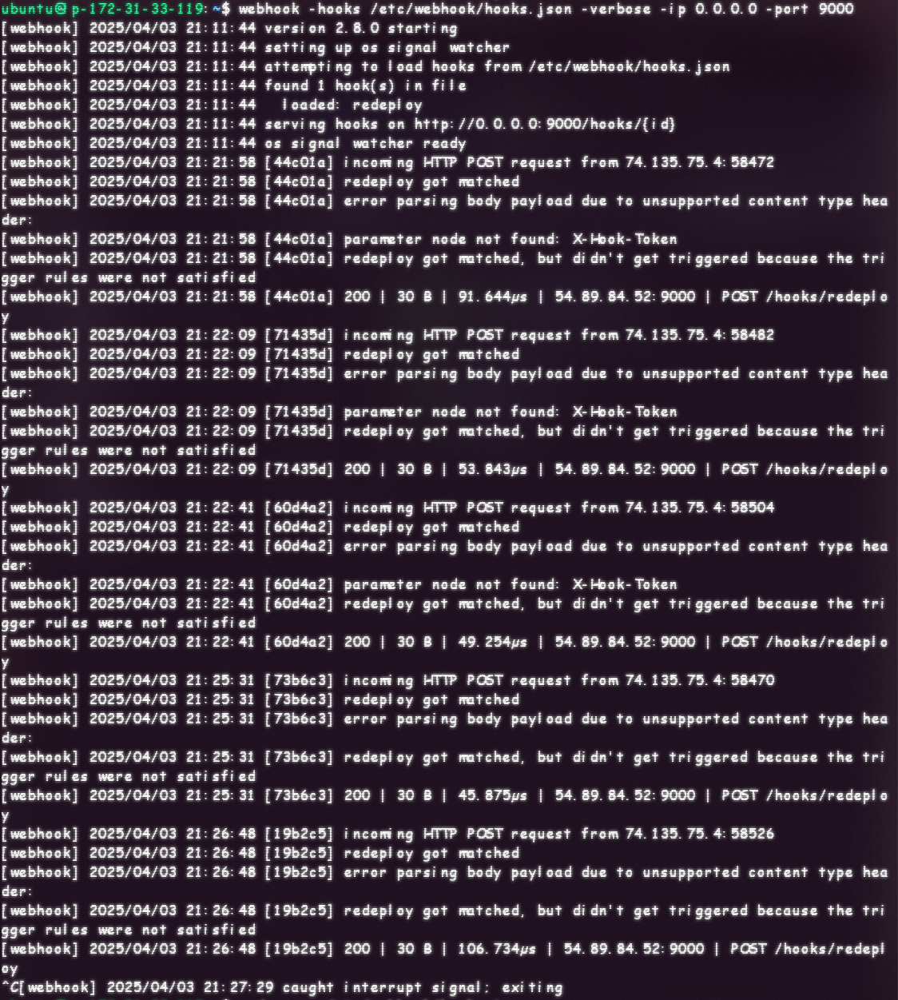
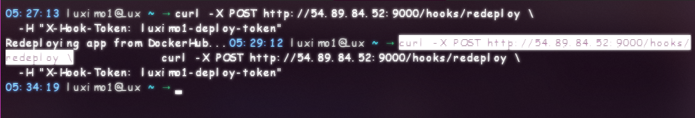
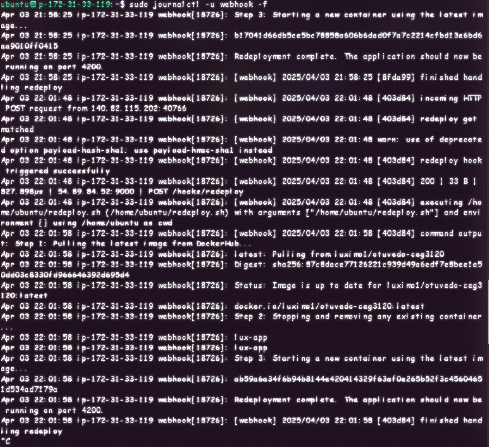
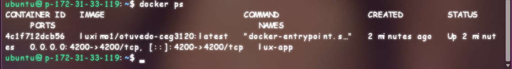

- [Project 5](#project-5)
- [CI/CD Workflow Implementation – Phase Four: Semantic Versioning and Release Tagging](#cicd-workflow-implementation--phase-four-semantic-versioning-and-release-tagging)
  - [1. Introduction](#1-introduction)
  - [2. Semantic Tagging Procedure](#2-semantic-tagging-procedure)
    - [Tag Naming Convention](#tag-naming-convention)
  - [3. Workflow Trigger Behavior](#3-workflow-trigger-behavior)
    - [Relevant Workflow File (Updated Version)](#relevant-workflow-file-updated-version)
    - [Example Execution](#example-execution)
  - [4. Tag Inference via `docker/metadata-action`](#4-tag-inference-via-dockermetadata-action)
    - [Sample Configuration](#sample-configuration)
  - [5. Tag Distribution on DockerHub](#5-tag-distribution-on-dockerhub)
    - [Repository](#repository)
    - [Example Tag Listing](#example-tag-listing)
- [CI/CD Workflow Implementation – Phase Five: Continuous Deployment via Webhooks on AWS EC2](#cicd-workflow-implementation--phase-five-continuous-deployment-via-webhooks-on-aws-ec2)
  - [1. Objective](#1-objective)
  - [2. Infrastructure Overview](#2-infrastructure-overview)
  - [3. Docker Environment Setup](#3-docker-environment-setup)
  - [4. Redeployment Script – `redeploy.sh`](#4-redeployment-script--redeploysh)
    - [Functionality](#functionality)
    - [File Path](#file-path)
    - [GitHub Reference](#github-reference)
  - [5. Webhook Engine – `adnanh/webhook`](#5-webhook-engine--adnanhwebhook)
    - [Purpose](#purpose)
    - [Installation](#installation)
    - [AWS Security Group Configuration](#aws-security-group-configuration)
  - [6. Webhook Hook Definition – `hooks.json`](#6-webhook-hook-definition--hooksjson)
    - [File Path](#file-path-1)
    - [GitHub Reference](#github-reference-1)
  - [7. Manual Webhook Test Procedure](#7-manual-webhook-test-procedure)
    - [Start Listener in Foreground](#start-listener-in-foreground)
    - [Simulate Webhook Trigger](#simulate-webhook-trigger)
    - [Log Inspection](#log-inspection)
    - [Container Verification](#container-verification)
  - [8. GitHub Webhook Configuration](#8-github-webhook-configuration)
  - [9. Systemd Service – `webhook.service`](#9-systemd-service--webhookservice)
    - [Purpose](#purpose-1)
    - [File Path](#file-path-2)
    - [GitHub Reference](#github-reference-2)
    - [Service Definition](#service-definition)
    - [Enable and Start](#enable-and-start)
- [Resources](#resources)


# Project 5

# CI/CD Workflow Implementation – Phase Four: Semantic Versioning and Release Tagging

## 1. Introduction

In this stage, we’re introducing a clear way to label our software versions using semantic versioning. Instead of relying on a generic ‘latest’ label for updates, we’ll use a structured system that follows the format ‘major.minor.patch’. To make it easy to understand, think of this like naming a special recipe for a dish. For example, if you have a recipe for a chocolate cake, you might call it “Chocolate Cake 1.0.0.” If you later make a big change, like adding a new layer, you would rename it to “Chocolate Cake 2.0.0,” indicating a major update. On the other hand, if you only made small adjustments, such as changing the brand of cocoa powder, you might call it “Chocolate Cake 1.1.0.” This way, anyone can easily see what kind of changes have been made with each new version.

The approach ensures:
- Predictable release management  
- Backward-compatible rollbacks  
- Enhanced traceability of image versions on DockerHub  
- Integration of branding into the tagging system (`lux-vX.Y.Z`)

This functionality is powered by the `docker/metadata-action` GitHub Action module and is triggered upon annotated Git tag pushes.

---

## 2. Semantic Tagging Procedure

To manually create and push a versioned Git tag that conforms to [Semantic Versioning standards](https://semver.org/#semantic-versioning-200):

```
git tag -a lux-v1.1.0 -m "LuxOS: second release with version metadata"
git push origin lux-v1.1.0
```


### Tag Naming Convention

The following pattern is recommended for semantic releases:

```
<namespace>-v<major>.<minor>.<patch>
```

Examples:
- `lux-v1.0.0` – Initial major release  
- `lux-v1.1.0` – Minor feature additions  
- `lux-v1.1.1` – Patch-level fixes  

These tags act as immutable references and will trigger image builds under uniquely identifiable labels.

---

## 3. Workflow Trigger Behavior

Upon pushing a Git tag to the remote repository, the GitHub Actions pipeline (`docker-build.yml`) performs the following steps:

1. Detects the `push` event for a Git tag
2. Uses `docker/metadata-action` to extract semantic version components
3. Builds the Docker image from the project’s `Dockerfile`
4. Pushes the resulting image to DockerHub with multiple tags:

| Tag Format       | Description                                |
|------------------|--------------------------------------------|
| `lux-v1.1.0`     | Full semantic version (stable release ID)  |
| `lux-v1.1`       | Minor version shorthand                    |
| `lux-v1`         | Major version shorthand                    |
| `latest`         | Maintained for backward compatibility      |

### Relevant Workflow File (Updated Version)

```
.github/workflows/docker-build.yml
```

### Example Execution

Full build logs and confirmation of tagged actions are viewable at:  
[GitHub Actions – Enable semantic versioning via docker/metadata-action](https://github.com/WSU-kduncan/ceg3120-cicd-Luximo/actions/runs/14229282028/job/39876136413)

---

## 4. Tag Inference via `docker/metadata-action`

The `docker/metadata-action` module automatically parses the Git tag and dynamically sets image tags using built-in GitHub context variables.

### Sample Configuration

```
- uses: docker/metadata-action@v5
  id: meta
  with:
    images: luximo1/otuvedo-ceg3120
```

This module abstracts the complexity of tag parsing and ensures consistency across image pushes.

---

## 5. Tag Distribution on DockerHub

After a successful run, DockerHub will reflect the full spectrum of semantic tags derived from the pushed Git tag.

### Repository

```
https://hub.docker.com/repository/docker/luximo1/otuvedo-ceg3120/tags
```

### Example Tag Listing

| Tag Name       | Purpose                       |
|----------------|-------------------------------|
| `lux-v1.1.0`   | Fully qualified release tag   |
| `lux-v1.1`     | Minor shorthand               |
| `lux-v1`       | Major shorthand               |
| `latest`       | Legacy/latest compatibility   |

These tags map to the **same image digest**, ensuring that deployment targets can select their versioning precision (pinned vs. rolling).

---

# CI/CD Workflow Implementation – Phase Five: Continuous Deployment via Webhooks on AWS EC2

## 1. Objective

This phase establishes a **self-healing deployment pipeline** triggered by GitHub webhook events. Upon each push to the `main` branch, the system automates:

- Pulling the latest Docker image from DockerHub  
- Tearing down the old container  
- Launching the updated Angular frontend (`luximo1/otuvedo-ceg3120`)  
- Running entirely on an AWS EC2 instance using `adnanh/webhook` for HTTP-based event listening



---

## 2. Infrastructure Overview

| Attribute           | Value                            |
|---------------------|----------------------------------|
| Instance OS         | Ubuntu 24.04 LTS                 |
| Kernel              | 6.8.0-1024-aws x86_64            |
| Instance Type       | `t2.small` (1 vCPU, 2 GB RAM)    |
| Elastic IP          | `54.227.249.4`                   |
| Internal IP         | `172.31.33.119`                  |
| Docker Image        | `luximo1/otuvedo-ceg3120`        |

> A static **Elastic IP** was manually assigned to this EC2 instance to ensure a persistent public address for webhook communication. This prevents the GitHub webhook from breaking on instance reboot or restart.

---

## 3. Docker Environment Setup

To provision Docker and all supporting dependencies:

```
# Install system dependencies
sudo apt update
sudo apt install -y ca-certificates curl gnupg
```

- 

```
# Add Docker GPG key
sudo install -m 0755 -d /etc/apt/keyrings
curl -fsSL https://download.docker.com/linux/ubuntu/gpg | \
    sudo gpg --dearmor -o /etc/apt/keyrings/docker.gpg
sudo chmod a+r /etc/apt/keyrings/docker.gpg

# Add Docker’s APT repository
echo \
  "deb [arch=$(dpkg --print-architecture) signed-by=/etc/apt/keyrings/docker.gpg] \
  https://download.docker.com/linux/ubuntu \
  $(. /etc/os-release && echo "$VERSION_CODENAME") stable" \
  | sudo tee /etc/apt/sources.list.d/docker.list > /dev/null
```

- 

```
# Install Docker components
sudo apt update
sudo apt install -y docker-ce docker-ce-cli containerd.io \
    docker-buildx-plugin docker-compose-plugin

# Add user to docker group
sudo usermod -aG docker $USER
```

- 
> **Note:** Logout and back in to apply group membership changes at all times.

---

## 4. Redeployment Script – `redeploy.sh`

### Functionality

The redeployment script orchestrates container replacement upon webhook trigger:

- Pulls the latest image from DockerHub
- Stops and removes the previous container  
- Runs a new instance bound to host port 4200

### File Path

```
/home/ubuntu/redeploy.sh
```

### GitHub Reference

[deployment/redeploy.sh](https://github.com/WSU-kduncan/ceg3120-cicd-Luximo/blob/main/deployment/redeploy.sh)

---

## 5. Webhook Engine – `adnanh/webhook`

### Purpose

The `webhook` binary exposes an HTTP listener capable of executing scripts based on JSON-defined hook triggers.

### Installation

The `webhook` listener binary is available directly from Ubuntu's official APT repositories and can be installed with:

```
sudo apt update
sudo apt install -y webhook
```

> Version installed at time of writing: `2.8.0`

### AWS Security Group Configuration

| Port  | Description                      |
|-------|----------------------------------|
| 4200  | Application (Angular frontend)   |
| 9000  | Webhook listener endpoint        |

These ports must be opened in the EC2 instance’s associated security group by the way for it to work.

---

## 6. Webhook Hook Definition – `hooks.json`

This file configures the trigger endpoint (`/hooks/redeploy`) and defines the conditions under which `redeploy.sh` is executed.

### File Path

```
/etc/webhook/hooks.json
```

### GitHub Reference

[deployment/hooks.json](https://github.com/WSU-kduncan/ceg3120-cicd-Luximo/blob/main/deployment/hooks.json)

---

## 7. Manual Webhook Test Procedure

To validate the webhook setup manually:

### Start Listener in Foreground

```
webhook -hooks /etc/webhook/hooks.json -verbose -ip 0.0.0.0 -port 9000
```

- 

### Simulate Webhook Trigger

```
curl -X POST http://54.89.84.52:9000/hooks/redeploy \
  -H "X-Hook-Token: luximo1-deploy-token"
```

- 

### Log Inspection

```
sudo journalctl -u webhook -f
```

Look for:
- Hook matched and executed  
- Script path and exit status  
- Container logs or Docker activity

- 

### Container Verification

```
docker ps
```
- 
---

## 8. GitHub Webhook Configuration

To bind GitHub events to your EC2 deployment:

1. Go to repository then **Settings then Webhooks then click on Add webhook**
2. **Payload URL**:  
   ```
   http://54.227.249.4:9000/hooks/redeploy
   ```
   > This new IP is the same as noted in the infrastructure table.

3. Content Type: `application/json`  
4. Leave Secret blank (optional; token is already enforced via headers)  
5. Events to trigger: **Just the push event**  
6. Save and test delivery for 200 OK response

---

## 9. Systemd Service – `webhook.service`

### Purpose

Ensures `webhook` remains persistent across reboots and daemon reloads.

### File Path

```
/etc/systemd/system/webhook.service
```

### GitHub Reference

[deployment/webhook.service](https://github.com/WSU-kduncan/ceg3120-cicd-Luximo/blob/main/deployment/webhook.service)

### Service Definition

```
[Unit]
Description=Webhook Listener Service
After=network.target docker.service

[Service]
ExecStart=/usr/bin/webhook -hooks /etc/webhook/hooks.json -ip 0.0.0.0 -port 9000 -verbose
Restart=always
User=ubuntu
WorkingDirectory=/home/ubuntu

[Install]
WantedBy=multi-user.target
```

### Enable and Start

```
sudo systemctl daemon-reload
sudo systemctl enable webhook
sudo systemctl start webhook
```

To inspect the service:

```
sudo systemctl status webhook
```

# Resources
- []()

