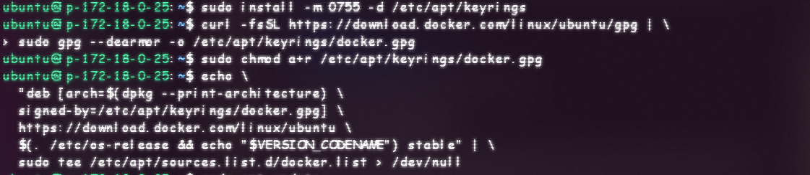
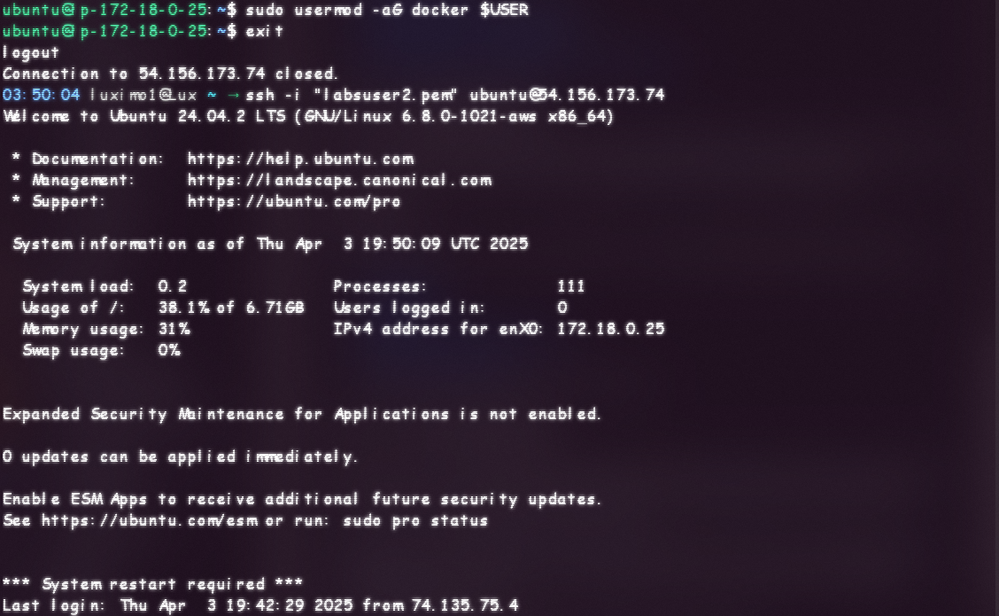
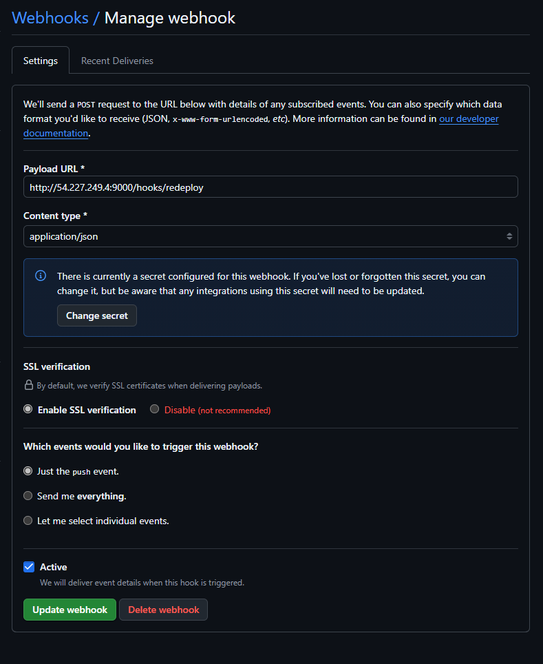

# CI/CD Workflow Implementation – Phase Four: Semantic Versioning and Release Tagging

## 1. Introduction

In this stage, we’re introducing a clear way to label our software versions using semantic versioning. Instead of relying on a generic ‘latest’ label for updates, we’ll use a structured system that follows the format ‘major.minor.patch’. To make it easy to understand, think of this like naming a special recipe for a dish. For example, if you have a recipe for a chocolate cake, you might call it “Chocolate Cake 1.0.0.” If you later make a big change, like adding a new layer, you would rename it to “Chocolate Cake 2.0.0,” indicating a major update. On the other hand, if you only made small adjustments, such as changing the brand of cocoa powder, you might call it “Chocolate Cake 1.1.0.” This way, anyone can easily see what kind of changes have been made with each new version.


## Contents
- [CI/CD Workflow Implementation – Phase Four: Semantic Versioning and Release Tagging](#cicd-workflow-implementation--phase-four-semantic-versioning-and-release-tagging)
  - [1. Introduction](#1-introduction)
  - [Contents](#contents)
  - [2. Semantic Tagging Procedure](#2-semantic-tagging-procedure)
    - [Tag Naming Convention](#tag-naming-convention)
  - [3. Workflow Trigger Behavior](#3-workflow-trigger-behavior)
    - [Relevant Workflow File (Updated Version)](#relevant-workflow-file-updated-version)
    - [Example Execution](#example-execution)
  - [4. Tag Inference via `docker/metadata-action`](#4-tag-inference-via-dockermetadata-action)
    - [Sample Configuration](#sample-configuration)
  - [5. Tag Distribution on DockerHub](#5-tag-distribution-on-dockerhub)
    - [Repository](#repository)
    - [Example Tag Listing](#example-tag-listing)
- [CI/CD Workflow Implementation – Phase Five: Continuous Deployment via Webhooks on AWS EC2](#cicd-workflow-implementation--phase-five-continuous-deployment-via-webhooks-on-aws-ec2)
  - [1. Objective](#1-objective)
  - [2. Infrastructure Overview](#2-infrastructure-overview)
  - [3. Docker Environment Setup](#3-docker-environment-setup)
  - [4. Redeployment Script – `redeploy.sh`](#4-redeployment-script--redeploysh)
    - [Functionality](#functionality)
    - [File Path](#file-path)
    - [GitHub Reference](#github-reference)
  - [5. Webhook Engine – `adnanh/webhook`](#5-webhook-engine--adnanhwebhook)
    - [Purpose](#purpose)
    - [Installation](#installation)
    - [AWS Security Group Configuration](#aws-security-group-configuration)
      - [Summary of Security Protocols:](#summary-of-security-protocols)
  - [6. Webhook Hook Definition – `hooks.json`](#6-webhook-hook-definition--hooksjson)
    - [File Path](#file-path-1)
    - [GitHub Reference](#github-reference-1)
  - [7. Manual Webhook Test Procedure](#7-manual-webhook-test-procedure)
    - [Start Listener in Foreground](#start-listener-in-foreground)
    - [Simulate Webhook Trigger](#simulate-webhook-trigger)
    - [Log Inspection](#log-inspection)
    - [Container Verification](#container-verification)
  - [8. GitHub Webhook Configuration](#8-github-webhook-configuration)
  - [9. Systemd Service – `webhook.service`](#9-systemd-service--webhookservice)
    - [Purpose](#purpose-1)
    - [File Path](#file-path-2)
    - [GitHub Reference](#github-reference-2)
    - [Service Definition](#service-definition)
    - [Enable and Start](#enable-and-start)
- [Implementing Fully Automated Deployment with GitHub Actions Webhook Integration](#implementing-fully-automated-deployment-with-github-actions-webhook-integration)
  - [Overview](#overview)
  - [Initial Setup](#initial-setup)
  - [Problem Identification](#problem-identification)
  - [Solution Implementation](#solution-implementation)
    - [Step 1: Update the GitHub Actions Workflow](#step-1-update-the-github-actions-workflow)
    - [Step 2: Configure Webhook on EC2 Instance](#step-2-configure-webhook-on-ec2-instance)
    - [Step 3: Troubleshooting Disk Space Issues](#step-3-troubleshooting-disk-space-issues)
    - [Step 4: Testing the Complete Automation](#step-4-testing-the-complete-automation)
- [Resources](#resources)

The approach ensures:
- Predictable release management  
- Backward-compatible rollbacks  
- Enhanced traceability of image versions on DockerHub  
- Integration of branding into the tagging system (`lux-vX.Y.Z`)

This functionality is powered by the `docker/metadata-action` GitHub Action module and is triggered upon annotated Git tag pushes.

---

## 2. Semantic Tagging Procedure

To manually create and push a versioned Git tag that conforms to [Semantic Versioning standards](https://semver.org/#semantic-versioning-200):

```
git tag -a lux-v1.1.0 -m "LuxOS: second release with version metadata"
git push origin lux-v1.1.0
```


### Tag Naming Convention

The following pattern is recommended for semantic releases:

```
<namespace>-v<major>.<minor>.<patch>
```

Examples:
- `lux-v1.0.0` – Initial major release  
- `lux-v1.1.0` – Minor feature additions  
- `lux-v1.1.1` – Patch-level fixes  

These tags act as immutable references and will trigger image builds under uniquely identifiable labels.

---

## 3. Workflow Trigger Behavior

Upon pushing a Git tag to the remote repository, the GitHub Actions pipeline (`docker-build.yml`) performs the following steps:

1. Detects the `push` event for a Git tag
2. Uses `docker/metadata-action` to extract semantic version components
3. Builds the Docker image from the project’s `Dockerfile`
4. Pushes the resulting image to DockerHub with multiple tags:

| Tag Format       | Description                                |
|------------------|--------------------------------------------|
| `lux-v1.1.0`     | Full semantic version (stable release ID)  |
| `lux-v1.1`       | Minor version shorthand                    |
| `lux-v1`         | Major version shorthand                    |
| `latest`         | Maintained for backward compatibility      |

### Relevant Workflow File (Updated Version)

```
.github/workflows/docker-build.yml
```

### Example Execution

Full build logs and confirmation of tagged actions are viewable at:  
[GitHub Actions – Enable semantic versioning via docker/metadata-action](https://github.com/WSU-kduncan/ceg3120-cicd-Luximo/actions/runs/14229282028/job/39876136413)

---

## 4. Tag Inference via `docker/metadata-action`

The `docker/metadata-action` module automatically parses the Git tag and dynamically sets image tags using built-in GitHub context variables.

### Sample Configuration

```
- uses: docker/metadata-action@v5
  id: meta
  with:
    images: luximo1/otuvedo-ceg3120
```

This module abstracts the complexity of tag parsing and ensures consistency across image pushes.

---

## 5. Tag Distribution on DockerHub

After a successful run, DockerHub will reflect the full spectrum of semantic tags derived from the pushed Git tag.

### Repository

```
https://hub.docker.com/repository/docker/luximo1/otuvedo-ceg3120/tags
```

### Example Tag Listing

| Tag Name       | Purpose                       |
|----------------|-------------------------------|
| `lux-v1.1.0`   | Fully qualified release tag   |
| `lux-v1.1`     | Minor shorthand               |
| `lux-v1`       | Major shorthand               |
| `latest`       | Legacy/latest compatibility   |

These tags map to the **same image digest**, ensuring that deployment targets can select their versioning precision (pinned vs. rolling).

---

# CI/CD Workflow Implementation – Phase Five: Continuous Deployment via Webhooks on AWS EC2

## 1. Objective

This phase establishes a **self-healing deployment pipeline** triggered by GitHub webhook events. Upon each push to the `main` branch, the system automates:

- Pulling the latest Docker image from DockerHub  
- Tearing down the old container  
- Launching the updated Angular frontend (`luximo1/otuvedo-ceg3120`)  
- Running entirely on an AWS EC2 instance using `adnanh/webhook` for HTTP-based event listening

---

## 2. Infrastructure Overview

| Attribute           | Value                            |
|---------------------|----------------------------------|
| Instance OS         | Ubuntu 24.04 LTS                 |
| Kernel              | 6.8.0-1024-aws x86_64            |
| Instance Type       | `t2.small` (1 vCPU, 2 GB RAM)    |
| Elastic IP          | `54.227.249.4`                   |
| Internal IP         | `172.31.33.119`                  |
| Docker Image        | `luximo1/otuvedo-ceg3120`        |

> A static **Elastic IP** was manually assigned to this EC2 instance to ensure a persistent public address for webhook communication. This prevents the GitHub webhook from breaking on instance reboot or restart.

---

## 3. Docker Environment Setup

To provision Docker and all supporting dependencies:

```
# Install system dependencies
sudo apt update
sudo apt install -y ca-certificates curl gnupg
```

- 

```
# Add Docker GPG key
sudo install -m 0755 -d /etc/apt/keyrings
curl -fsSL https://download.docker.com/linux/ubuntu/gpg | \
    sudo gpg --dearmor -o /etc/apt/keyrings/docker.gpg
sudo chmod a+r /etc/apt/keyrings/docker.gpg

# Add Docker’s APT repository
echo \
  "deb [arch=$(dpkg --print-architecture) signed-by=/etc/apt/keyrings/docker.gpg] \
  https://download.docker.com/linux/ubuntu \
  $(. /etc/os-release && echo "$VERSION_CODENAME") stable" \
  | sudo tee /etc/apt/sources.list.d/docker.list > /dev/null
```

- 

```
# Install Docker components
sudo apt update
sudo apt install -y docker-ce docker-ce-cli containerd.io \
    docker-buildx-plugin docker-compose-plugin

# Add user to docker group
sudo usermod -aG docker $USER
```

- 
> **Note:** Logout and back in to apply group membership changes at all times.

---

## 4. Redeployment Script – `redeploy.sh`

### Functionality

The redeployment script orchestrates container replacement upon webhook trigger:

- Pulls the latest image from DockerHub
- Stops and removes the previous container  
- Runs a new instance bound to host port 4200

### File Path

```
/home/ubuntu/redeploy.sh
```

### GitHub Reference

[deployment/redeploy.sh](https://github.com/WSU-kduncan/ceg3120-cicd-Luximo/blob/main/deployment/redeploy.sh)

---

## 5. Webhook Engine – `adnanh/webhook`

### Purpose

The `webhook` binary exposes an HTTP listener capable of executing scripts based on JSON-defined hook triggers.

### Installation

The `webhook` listener binary is available directly from Ubuntu's official APT repositories and can be installed with:

```
sudo apt update
sudo apt install -y webhook
```

> Version installed at time of writing: `2.8.0`

### AWS Security Group Configuration

| **Port** | **Protocol** | **Source**          | **Description**                                                                                                  |
|----------|--------------|---------------------|------------------------------------------------------------------------------------------------------------------|
| **4200** | TCP          | 0.0.0.0/0           | Application (Angular Frontend) - Required for external user access to the web application via browsers.          |
| **9000** | TCP          | GitHub IP Range     | Webhook Listener Endpoint - Restricted exclusively to GitHub's IP ranges to ensure webhook payloads originate from authorised GitHub servers. |
| **22**   | TCP          | My IP Address       | SSH Access - Limited to administrator IP addresses, ensuring secure management and resolution of technical issues. |

#### Summary of Security Protocols:

This security group configuration adheres rigorously to the **principle of the least privilege**, focusing on mitigating potential vulnerabilities and ensuring operational security by implementing the following measures:

1. **Selective Internet Exposure**: Only the application port (4200) is open to the public internet, facilitating user access to the Angular frontend, whilst minimising exposure of other services.
   
2. **Webhook Traffic Restriction**: Network traffic on port 9000 is strictly confined to GitHub's verified IP address ranges, thereby negating unauthorised attempts at webhook invocation or exploitation by malicious entities.
   
3. **Controlled Administrator Access**: SSH access is exclusively restricted to recognised administrator IP addresses, significantly narrowing the attack surface and thwarting brute force attacks.
   
4. **Implicit Traffic Denial**: All other inbound traffic is implicitly blocked, further consolidating the security framework and precluding unforeseen vulnerabilities.

These ports must be opened in the EC2 instance’s associated security group by the way for it to work.

---

## 6. Webhook Hook Definition – `hooks.json`

This file configures the trigger endpoint (`/hooks/redeploy`) and defines the conditions under which `redeploy.sh` is executed.

### File Path

```
/etc/webhook/hooks.json
```

### GitHub Reference

[deployment/hooks.json](https://github.com/WSU-kduncan/ceg3120-cicd-Luximo/blob/main/deployment/hooks.json)

---

## 7. Manual Webhook Test Procedure

To validate the webhook setup manually:

### Start Listener in Foreground

```
webhook -hooks /etc/webhook/hooks.json -verbose -ip 0.0.0.0 -port 9000
```

- 

### Simulate Webhook Trigger

```
curl -X POST http://54.89.84.52:9000/hooks/redeploy \
  -H "X-Hook-Token: luximo1-deploy-token"
```

- 

### Log Inspection

```
sudo journalctl -u webhook -f
```

Look for:
- Hook matched and executed  
- Script path and exit status  
- Container logs or Docker activity

- 

### Container Verification

```
docker ps
```
- 
---

## 8. GitHub Webhook Configuration

To bind GitHub events to your EC2 deployment:

1. Go to repository then **Settings then Webhooks then click on Add webhook**
2. **Payload URL**:  
   ```
   http://54.227.249.4:9000/hooks/redeploy
   ```
   > This new IP is the same as noted in the infrastructure table.

3. Content Type: `application/json`  
4. Leave Secret blank (optional; token is already enforced via headers)  
5. Events to trigger: **Just the push event**  
6. Save and test delivery for 200 OK response

   - Do it like this: 👀🥱
     - 
---

## 9. Systemd Service – `webhook.service`

### Purpose

Ensures `webhook` remains persistent across reboots and daemon reloads.

### File Path

```
/etc/systemd/system/webhook.service
```

### GitHub Reference

[deployment/webhook.service](https://github.com/WSU-kduncan/ceg3120-cicd-Luximo/blob/main/deployment/webhook.service)

### Service Definition

```
[Unit]
Description=Webhook Listener Service
After=network.target docker.service

[Service]
ExecStart=/usr/bin/webhook -hooks /etc/webhook/hooks.json -ip 0.0.0.0 -port 9000 -verbose
Restart=always
User=ubuntu
WorkingDirectory=/home/ubuntu

[Install]
WantedBy=multi-user.target
```

### Enable and Start

```
sudo systemctl daemon-reload
sudo systemctl enable webhook
sudo systemctl start webhook
```

To inspect the service:

```
sudo systemctl status webhook
```

# Implementing Fully Automated Deployment with GitHub Actions Webhook Integration

## Overview

This document outlines how I modified our CI/CD pipeline to achieve true end-to-end automation, eliminating the need for manual intervention after a successful build. Originally, our GitHub Actions workflow built and pushed Docker images to DockerHub, but required manual execution of a redeploy script on the EC2 instance to update the running application. I resolved this by implementing a webhook-based system that automatically triggers redeployment when a new image is available.

## Initial Setup

Our pipeline consisted of:
- GitHub repository with an Angular application
- GitHub Actions workflow that builds and pushes Docker images on tag push
- DockerHub repository storing the images
- EC2 instance running the application in a Docker container
- Manual redeploy script (`redeploy.sh`) on the EC2 instance

## Problem Identification

I identified two key issues with my setup:

1. **Manual Intervention Required**: After pushing a tag and triggering a build, I had to SSH into the EC2 instance and manually run `./redeploy.sh` to update the application.

2. **GitHub Actions and Webhook Disconnect**: While GitHub could send webhook payloads to the EC2 instance, the webhook wasn't being triggered properly due to authentication issues.

## Solution Implementation

### Step 1: Update the GitHub Actions Workflow

I modified my `.github/workflows/docker-build.yml` to include a step that triggers the webhook after a successful build:

```
- name: Trigger deployment webhook
  if: success()
  run: |
    curl -X POST http://54.227.249.4:9000/hooks/redeploy \
      -H "X-Hook-Token: luximo1-deploy-token" \
      -H "Content-Type: application/json" \
      -d '{"event": "push", "repository": "${{ github.repository }}", "ref": "${{ github.ref }}"}'
```

### Step 2: Configure Webhook on EC2 Instance

I updated the webhook configuration on the EC2 instance to use a simpler token-based authentication, thanks to [simpler token-based authentication](https://stackoverflow.com/questions/40498098/why-do-webhook-implementations-avoid-token-based-security):

1. SSH into the instance:
   ```
   ssh -i "labsuser2.pem" ubuntu@54.227.249.4
   ```

2. Navigate to the webhook configuration directory:
   ```
   cd /etc/webhook
   ```

3. Edit the hooks.json file:
   ```
   sudo nano hooks.json
   ```

4. Replace the HMAC-based authentication with a simpler token-based approach:
   ```
   [
     {
       "id": "redeploy",
       "execute-command": "/home/ubuntu/redeploy.sh",
       "command-working-directory": "/home/ubuntu",
       "response-message": "Redeploying app from DockerHub...",
       "trigger-rule": {
         "match": {
           "type": "value",
           "value": "luximo1-deploy-token",
           "parameter": {
             "source": "header",
             "name": "X-Hook-Token"
           }
         }
       }
     }
   ]
   ```

5. Restart the webhook service:
   ```
   sudo systemctl restart webhook
   ```

### Step 3: Troubleshooting Disk Space Issues

When testing my solution, I encountered "no space left on device" errors. I fixed this by cleaning up disk space:

1. Check disk usage:
   ```
   df -h
   ```
- **`-h`**: Displays sizes in a human-readable format (e.g., MB, GB, etc.).
  - Result showed 97% usage, leaving only 716MB free.

1. Clean up Docker resources:
   ```
   docker system prune -af --volumes
   ```
- **`-a`**: Removes all unused containers, networks, images, and build caches, not just dangling ones.
- **`-f`**: Forces the prune action without prompting for confirmation.
- **`--volumes`**: Includes unused volumes in the pruning process.
  - This reclaimed 9.927GB of space.

1. Clean up system logs:
   ```
   sudo find /var/log -type f -name "*.gz" -delete
   sudo find /var/log -type f -name "*.1" -delete
   sudo journalctl --vacuum-time=1d
   ```
-  **Find and Delete Logs**:  
   `sudo find /var/log -type f -name "*.gz" -delete` deletes compressed logs (`.gz`).  
   `sudo find /var/log -type f -name "*.1" -delete` removes rotated logs (`.1`).

- **Vacuum System Journal Logs**:  
   `sudo journalctl --vacuum-time=1d` clears logs older than 1 day at least for now.

- **Docker Cleanup**:  
   `docker system prune -af --volumes` force-deletes unused containers, networks, images, and volumes.

2. Verify disk space:
   ```
   df -h
   ```
- **`-h`**: Displays sizes in a human-readable format (e.g., MB, GB, etc.).
  - Result showed 26% usage, freeing up approximately 14 GB.

### Step 4: Testing the Complete Automation

1. Make a change to our Angular application's mission header:
   ```
   <h2 class="text-2xl font-semibold mb-4">Our Victorian Thorngate Mission</h2>
   ```

2. Commit and push the changes:
   ```
   git add .
   git commit -m "Updated Mission Header to Thorngate"
   git push origin main
   ```

3. Create and push a tag to trigger the workflow:
   ```
   git tag lux-v6.9.8
   git push origin lux-v6.9.8
   ```

4. Verify GitHub Actions workflow executed successfully

5. Check webhook logs on EC2:
   ```
   sudo journalctl -u webhook -f
   ```
   Logs confirmed successful webhook trigger and execution of redeploy script.

6. Verify the application was updated by accessing `http://54.227.249.4:4200` again.

---

# Resources

- [adnanh/webhook GitHub Repo](https://github.com/adnanh/webhook)
  - Official repo for the webhook listener used to trigger shell scripts from HTTP POST events.

- [Setting up webhooks with GitHub](https://docs.github.com/en/developers/webhooks-and-events/webhooks/creating-webhooks)
  - Used to configure repository-level webhook that POSTs on every `main` branch push.

- [Stack Overflow – Webhook trigger conditions](https://stackoverflow.com/questions/61197429/how-to-trigger-gitlab-ci-pipeline-manually-when-in-normal-conditions-it-is-tri)  
  - Helped debug "Hook rules were not satisfied" errors during POST header testing.

- [Systemd service creation tutorial](https://linuxconfig.org/how-to-create-systemd-service-unit-in-linux)
  - Guided the creation of `webhook.service` for automatic listener startup on EC2 boot.

- [Stack Overflow – How to use Webhooks](https://stackoverflow.com/questions/72764189/how-to-set-up-webhook-endpoint-so-that-it-can-accept-https-requests)
  - Provided additional insight into how webhook-based triggers can be structured securely.

- [Install Docker on Ubuntu (Official Docs)](https://docs.docker.com/engine/install/ubuntu/)
  - Steps used to install and verify Docker engine, CLI, and Compose on Ubuntu 24.04.

- [Stack Overflow – Docker container restart best practices](https://stackoverflow.com/questions/79067260/webhook-service-isnt-triggering)
  - Informed `Restart=always` setting in `webhook.service` unit file.

- [Diagrams Python Library (Official)](https://diagrams.mingrammer.com/)  
  - Used to generate local architecture diagrams showing CI/CD workflow using AWS, Docker, and Webhooks.

- [D3.js Force-Directed Graph](https://observablehq.com/@d3/force-directed-graph)  
  → Reference for building the interactive GitHub→EC2 pipeline visual using D3.js and tooltips.

- [Webhook Architecture for Automation Pipelines](https://www.researchgate.net/publication/389822008_Cloud-Native_DevSecOps_Integrating_Security_Automation_into_CICD_Pipelines)  
  - Supported using webhooks to achieve push-to-deploy automation in microservice systems.

- [Automating CI/CD Workflows in Cloud Deployments](https://www.researchgate.net/publication/390141404_Automating_Scalable_CICD_Pipelines_for_Cloud-_Native_Microservices)  
   Helped validate structure of our redeployment pipeline from GitHub, DockerHub,  EC2.

- [journalctl Usage Guide (Ubuntu)](https://man7.org/linux/man-pages/man1/journalctl.1.html)  
  - Used for real-time service monitoring and hook trigger validation (`journalctl -u webhook -f`).

- [curl Manual – POST with Headers](https://curl.se/docs/manual.html)  
  - Confirmed correct syntax to test webhook trigger using custom `X-Hook-Token` headers.
