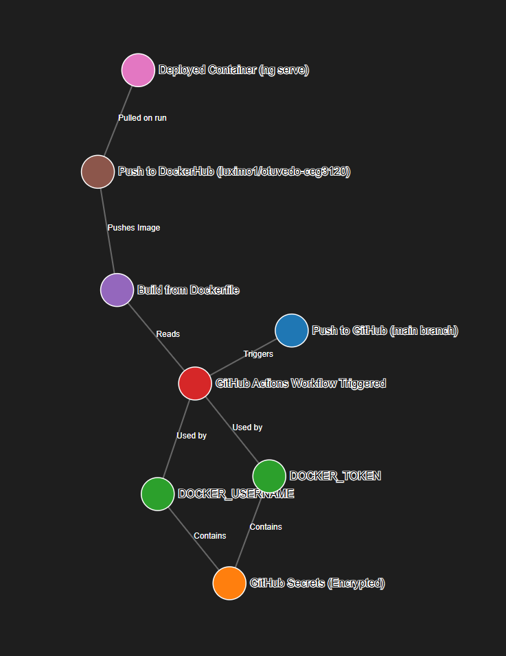
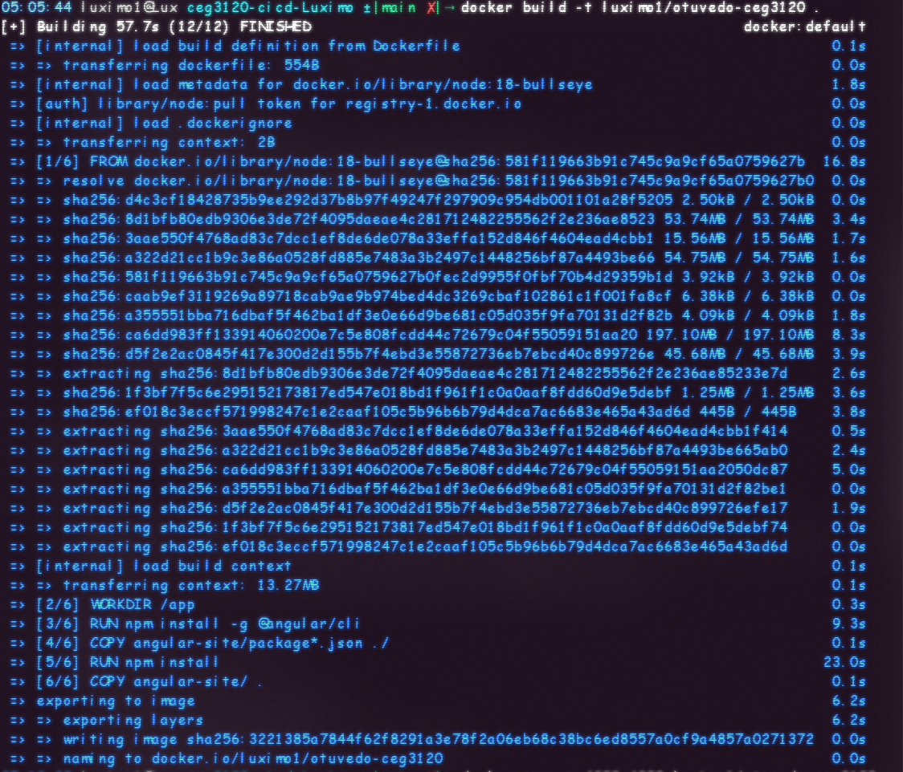
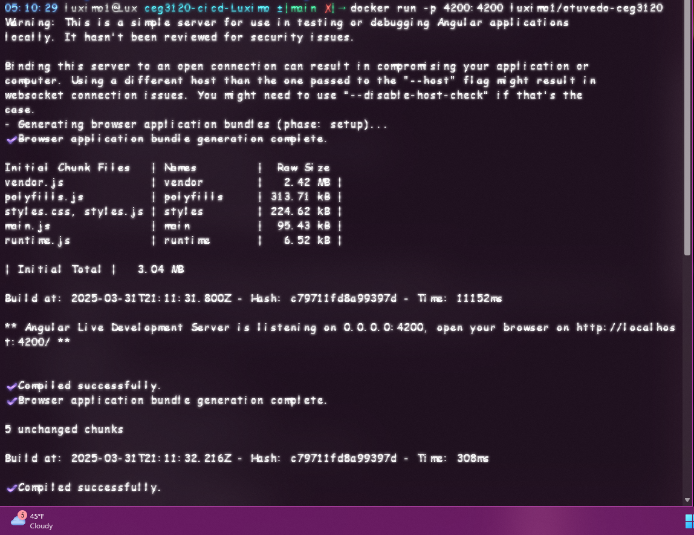
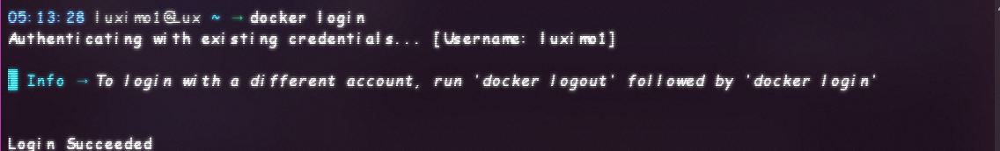
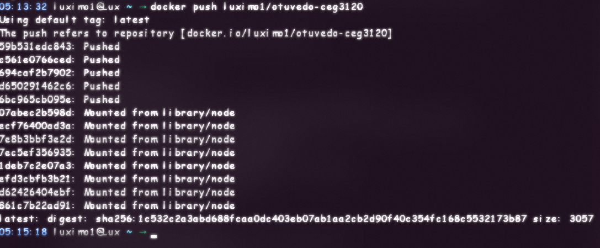
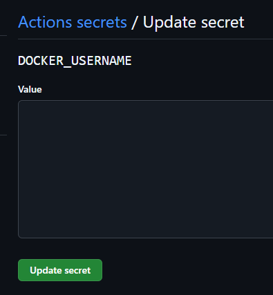
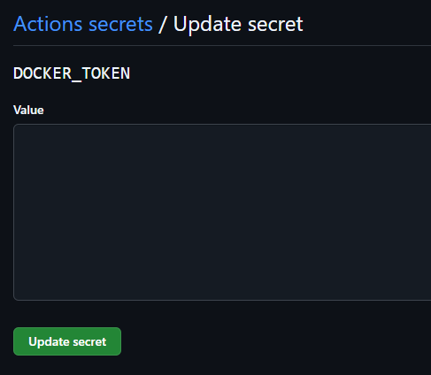
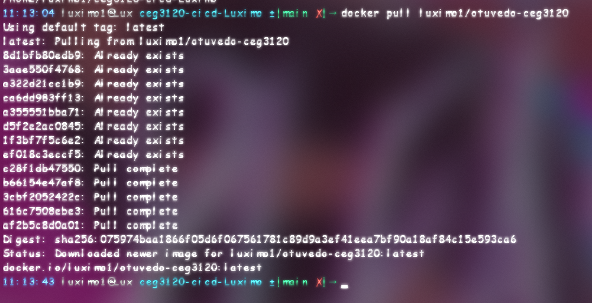
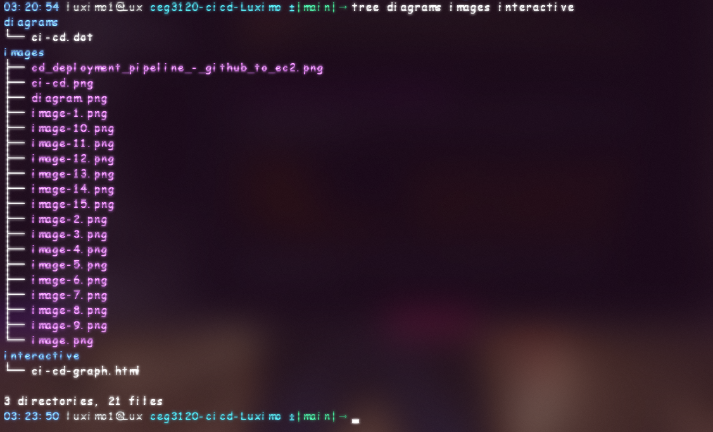

# CI/CD Workflow Implementation – Phase One: Angular Frontend Containerization

## Abstract

This Project Phase 1 explains how I am creating a version of a web application designed with Angular, which will be packaged in a container as part of a broader initiative outlined in Phase 1 of this three-phase project. In this stage, I aim to develop a straightforward and adaptable Docker image for a single-page Angular application, which I will then share on DockerHub. You can think of it like preparing a well-organised dessert: just as you would bake a cake, decorate it, and put it into a box to keep it fresh for anyone who wants to enjoy it, we’re doing something similar with our application. We have documented every step of the process, from manually testing it to creating a set of instructions for building our Docker image and finally sharing it publicly, ensuring that everyone, regardless of the platform they use, can access and enjoy it without any hassle.

---



## Contents

- [CI/CD Workflow Implementation – Phase One: Angular Frontend Containerization](#cicd-workflow-implementation--phase-one-angular-frontend-containerization)
  - [Abstract](#abstract)
  - [Contents](#contents)
  - [1. Project Context](#1-project-context)
    - [Objectives](#objectives)
    - [Application: `Birds Gone Wild`](#application-birds-gone-wild)
  - [2. Technical Environment](#2-technical-environment)
    - [Docker Installation (WSL2 Backend)](#docker-installation-wsl2-backend)
  - [3. Preliminary Manual Containerization](#3-preliminary-manual-containerization)
    - [Runtime Procedure](#runtime-procedure)
  - [4. Declarative Dockerfile Construction](#4-declarative-dockerfile-construction)
    - [Dockerfile](#dockerfile)
    - [Build Logic](#build-logic)
  - [5. Image Compilation \& Execution](#5-image-compilation--execution)
    - [Image Build](#image-build)
    - [Local Run](#local-run)
  - [6. Container Registry Integration](#6-container-registry-integration)
    - [Repository Provisioning](#repository-provisioning)
    - [CLI Authentication](#cli-authentication)
    - [Push Operation](#push-operation)
    - [Repository Access](#repository-access)
  - [7. Application Accessibility](#7-application-accessibility)
- [CI/CD Workflow Implementation – Phase Two: GitHub Actions Automation \& Registry Synchronization](#cicd-workflow-implementation--phase-two-github-actions-automation--registry-synchronization)
  - [1. Overview](#1-overview)
  - [2. Secure Integration with DockerHub](#2-secure-integration-with-dockerhub)
    - [2.1 Required Secrets](#21-required-secrets)
    - [2.2 Configuring Secrets](#22-configuring-secrets)
  - [3. Workflow Automation via GitHub Actions](#3-workflow-automation-via-github-actions)
    - [3.1 Workflow Trigger](#31-workflow-trigger)
    - [3.2 Job Definition: `build-and-push`](#32-job-definition-build-and-push)
    - [3.3 Key Components](#33-key-components)
  - [4. Repository and Image Distribution](#4-repository-and-image-distribution)
    - [4.1 DockerHub Target](#41-dockerhub-target)
    - [4.2 Docker Pull Command](#42-docker-pull-command)
      - [Workflow file link](#workflow-file-link)
  - [5. Reusability and Extension](#5-reusability-and-extension)
- [CI/CD Workflow Implementation – Phase Three: Visualization and System Mapping](#cicd-workflow-implementation--phase-three-visualization-and-system-mapping)
  - [1. Purpose and Scope](#1-purpose-and-scope)
  - [2. Tooling \& Methodology](#2-tooling--methodology)
  - [3. Repository Structure for Diagram Assets](#3-repository-structure-for-diagram-assets)
  - [4. Static Diagram Generation – Graphviz](#4-static-diagram-generation--graphviz)
    - [Command to Generate Output](#command-to-generate-output)
    - [Embedded Preview](#embedded-preview)
  - [5. Interactive Visualization – D3.js](#5-interactive-visualization--d3js)
    - [Interactive Features](#interactive-features)
    - [Accessing the Interactive Version](#accessing-the-interactive-version)
  - [6. Logical Flow Model](#6-logical-flow-model)
- [Troubleshooting Section](#troubleshooting-section)
  - [1. Webhook Service Not Triggering](#1-webhook-service-not-triggering)
    - [Problem](#problem)
    - [Diagnosis](#diagnosis)
    - [Solution](#solution)
  - [2. Hook Rules Not Being Satisfied](#2-hook-rules-not-being-satisfied)
    - [Problem](#problem-1)
    - [Diagnosis](#diagnosis-1)
    - [Solution](#solution-1)
  - [3. Container Not Updating After Image Pull](#3-container-not-updating-after-image-pull)
    - [Problem](#problem-2)
    - [Diagnosis](#diagnosis-2)
    - [Solution](#solution-2)
  - [4. AWS Security Group Configuration Issues](#4-aws-security-group-configuration-issues)
    - [Problem](#problem-3)
    - [Diagnosis](#diagnosis-3)
    - [Solution](#solution-3)
  - [5. Missing Docker Group Permissions](#5-missing-docker-group-permissions)
    - [Problem](#problem-4)
    - [Diagnosis](#diagnosis-4)
    - [Solution](#solution-4)
  - [6. Semantic Version Tag Parsing Issues](#6-semantic-version-tag-parsing-issues)
    - [Problem](#problem-5)
    - [Diagnosis](#diagnosis-5)
    - [Solution](#solution-5)
- [Resources](#resources)

---

## 1. Project Context

This repository encapsulates the first milestone in a multi-phase DevOps pipeline implementation, aiming to reinforce containerization best practices and introduce Docker-centric automation workflows.

### Objectives

- Encapsulate an Angular application within a Docker container.  
- Validate runtime environment through both manual and declarative methods.  
- Publish containerized application to a public registry for universal accessibility.

### Application: `Birds Gone Wild`

The target application is a responsive Angular SPA, visually themed and bundled with an epic Eagle imagery and custom navigation logic. It is located under `angular-site/`.

---

## 2. Technical Environment

| Component      | Version / Spec                     |
|----------------|------------------------------------|
| Host OS        | Windows (Docker Desktop with WSL2) |
| Container Base | `node:18-bullseye`                 |
| Framework      | Angular CLI (latest via npm)       |
| Registry       | DockerHub                          |
| CLI Tools      | Docker, WSL, Git                   |

### Docker Installation (WSL2 Backend)

```
wsl --install
docker --version
```

Installation source:  
[Install Docker Desktop on Windows](https://desktop.docker.com/win/main/amd64/Docker%20Desktop%20Installer.exe?_gl=1*1glbvc0*_gcl_au*NTY1OTMzODU3LjE3NDI1NjA0NDk.*_ga*MTc1NjI2MjY5OS4xNzM4NDIzNDk1*_ga_XJWPQMJYHQ*MTc0MzU5MzUyMS41LjEuMTc0MzU5MzUyNi41NS4wLjA.)

---

## 3. Preliminary Manual Containerization

This section illustrates a containerized Angular workflow executed entirely via CLI, without a `Dockerfile`. This is useful for prototyping or live-debug scenarios.

### Runtime Procedure

```
docker run -it --rm node:18-bullseye bash
```

Inside the container:

```
npm install -g @angular/cli
# Transfer angular-site/ via volume or docker cp
cd /app
npm install
ng serve --host 0.0.0.0
```

Rationale: Running Angular on `0.0.0.0` allows exposure through Docker port forwarding to the host system.

---

## 4. Declarative Dockerfile Construction

A production-ready `Dockerfile` was constructed to encapsulate the Angular build and serve processes using a multistep strategy.

### Dockerfile

```
# Use official Node.js 18 image as base
FROM node:18-bullseye

# Set the working directory inside the container
WORKDIR /app

# Install Angular CLI globally
RUN npm install -g @angular/cli

# Copy package.json and package-lock.json first (to leverage caching)
COPY angular-site/package*.json ./

# Install dependencies
RUN npm install

# Copy the rest of the application
COPY angular-site/ .

# Expose the port Angular uses
EXPOSE 4200

# Run the Angular development server
CMD ["ng", "serve", "--host", "0.0.0.0"]

```

### Build Logic

- The image builds from a slim Debian-based Node.js distribution.  
- Angular CLI is installed globally to support live serving.  
- The working directory is isolated and layered with `COPY` and `RUN` to optimize build caching.  
- The application is served over port 4200 to enable host access via port mapping.

---

## 5. Image Compilation & Execution

### Image Build

```
docker build -t luximo1/otuvedo-ceg3120 .
```


- Tag: `luximo1/otuvedo-ceg3120`  
- Build Context: Root project directory

### Local Run

```
docker run -p 4200:4200 luximo1/otuvedo-ceg3120
```



Mapping `4200:4200` enables browser-based access on the host at `http://localhost:4200`.


---

## 6. Container Registry Integration

### Repository Provisioning

A public repository was created at DockerHub under the namespace:

```
luximo1/otuvedo-ceg3120
```

Steps:
- Log in to DockerHub
- Create a new repository (`Public`)
- Repository name: `otuvedo-ceg3120`

### CLI Authentication

```
docker login
```

Enter:
- DockerHub Username: `luximo1`
- DockerHub Password or PAT



### Push Operation

```
docker push luximo1/otuvedo-ceg3120
```



This operation uploads the image layers and publishes the tagged build to the DockerHub registry.

### Repository Access

URL:  
[https://hub.docker.com/repository/docker/luximo1/otuvedo-ceg3120/general](https://hub.docker.com/repository/docker/luximo1/otuvedo-ceg3120/general)

To replicate the environment elsewhere:

```
docker pull luximo1/otuvedo-ceg3120
docker run -p 4200:4200 luximo1/otuvedo-ceg3120
```

---

## 7. Application Accessibility

Once the container is instantiated and running, navigate to:

```
http://localhost:4200
```

This confirms that the browser rendered the SPA titled **Birds Gone Wild**, including an epic eagle graphic, themed layout, and a functional angular navigation component.

# CI/CD Workflow Implementation – Phase Two: GitHub Actions Automation & Registry Synchronization

## 1. Overview

This phase introduces continuous deployment by leveraging GitHub Actions to automate Docker image builds and distribution workflows. Upon every push to the `main` branch, the pipeline performs the following:

- Authenticates with DockerHub using encrypted secrets.  
- Builds the Angular container using the project’s Dockerfile.  
- Tags and pushes the image to a public DockerHub repository.  

This eliminates the need for manual `docker build` and `docker push` operations, aligning the workflow with modern Infrastructure-as-Code (IaC) and Continuous Deployment (CD) standards.

---

## 2. Secure Integration with DockerHub

GitHub Actions workflows require authenticated access to DockerHub in order to push images. This is achieved through GitHub repository secrets.

### 2.1 Required Secrets

| Secret Name       | Purpose                                              |
|-------------------|------------------------------------------------------|
| `DOCKER_USERNAME` | DockerHub account username (`luximo1`)              |
| `DOCKER_TOKEN`    | DockerHub Personal Access Token (Read/Write scope)  |

Secrets are environment-injected variables, encrypted at rest and never exposed in logs or build artifacts.

### 2.2 Configuring Secrets

To define these secrets within a GitHub repository:

1. Navigate to:  
   `GitHub Repository (ceg3120-cicd-Luximo) then Settings then Secrets and variables then click Actions`

2. Select **New repository secret**

3. Create the following key-value pairs:
   - `DOCKER_USERNAME = luximo1`
     - 
   - `DOCKER_TOKEN = <your personal access token>`
     - 

Personal access tokens can be generated from here:  
- Click on `DockerHub Avatar then Account Settings then Personal Access Token and click on Generate New Token`

---

## 3. Workflow Automation via GitHub Actions

A GitHub Actions pipeline is declared in:

```
.github/workflows/docker-build.yml
```

This workflow is automatically triggered on every push to the `main` branch. It builds and deploys a Docker image defined by the `Dockerfile` in the project root.

### 3.1 Workflow Trigger

```
on:
  push:
    branches:
      - main
```

This ensures deployment automation only occurs for production-bound commits on the `main` branch.

### 3.2 Job Definition: `build-and-push`

```

jobs:
  # Define the job for building and pushing Docker images
  build-and-push:
    # Specify the runner environment as Ubuntu latest version
    runs-on: ubuntu-latest

    # List the sequence of steps to execute in this job
    steps:
      # Step 1: Check out the repository code to the runner
      - name: Checkout repository
        uses: actions/checkout@v4

      # Step 2: Set up Docker Buildx for multi-platform image building
      - name: Set up Docker Buildx
        uses: docker/setup-buildx-action@v3

      # Step 3: Authenticate with DockerHub using stored credentials
      - name: Log in to DockerHub
        uses: docker/login-action@v3
        with:
          # Use repository secrets for secure credential storage
          username: ${{ secrets.DOCKER_USERNAME }}
          password: ${{ secrets.DOCKER_TOKEN }}

      # Step 4: Build the Docker image and push it to DockerHub
      - name: Build and push Docker image with tag
        uses: docker/build-push-action@v5
        with:
          # Specify build context as current directory
          context: .
          # Path to the Dockerfile
          file: ./Dockerfile
          # Enable pushing to registry
          push: true
          # Define image tags - one with version from git tag, one as latest
          tags: |
            luximo1/otuvedo-ceg3120:${{ github.ref_name }}
            luximo1/otuvedo-ceg3120:latest
```

### 3.3 Key Components

| Component                      | Description                                                                 |
|-------------------------------|-----------------------------------------------------------------------------|
| `actions/checkout`            | Pulls the repository contents into the workflow runner                     |
| `docker/setup-buildx-action` | Enables advanced build features (layer caching, multi-arch, etc.)          |
| `docker/login-action`         | Authenticates securely using the injected secrets                          |
| `docker/build-push-action`    | Builds the container image and pushes it to DockerHub                      |

---

## 4. Repository and Image Distribution

### 4.1 DockerHub Target

The image is pushed to the following public repo:

**DockerHub:**  
[https://hub.docker.com/repository/docker/luximo1/otuvedo-ceg3120/general](https://hub.docker.com/repository/docker/luximo1/otuvedo-ceg3120/general)

### 4.2 Docker Pull Command

To retrieve the latest deployed image:

```
docker pull luximo1/otuvedo-ceg3120
docker run -p 4200:4200 luximo1/otuvedo-ceg3120
```


This image will reflect the most recent commit to the `main` branch, ensuring immutable and reproducible deployments.

#### Workflow file link
- [Workflow file in my GitHub repo](https://github.com/WSU-kduncan/ceg3120-cicd-Luximo/actions/runs/14219530053/workflow)
---

## 5. Reusability and Extension

This workflow can be adapted for use across multiple repositories with minimal change. The only required modifications are:

- Update the image tag to match your DockerHub namespace:
  
  ```
  tags: your-dockerhub-username/your-repo-name:latest
  ```

- Ensure both `DOCKER_USERNAME` and `DOCKER_TOKEN` secrets are present in the new repository.

- Ensure a valid `Dockerfile` exists in the root or update the `file:` path accordingly.

---

# CI/CD Workflow Implementation – Phase Three: Visualization and System Mapping

## 1. Purpose and Scope

This phase provides visual documentation for the CI/CD pipeline established in the earlier stages. I have created diagrams to show how the system is structured, how different resources work together, and what triggers the automation throughout the process of packaging and deploying applications. The final materials include both simple images and interactive formats, making them easy for everyone, regardless of technical knowledge, to understand.

---

## 2. Tooling & Methodology

| Tool         | Application Scope                                                                 |
|--------------|-------------------------------------------------------------------------------------|
| Graphviz     | Generated a static `.png` diagram from a declarative `.dot` source file            |
| D3.js        | Created an interactive, web-based graph model of the CI/CD pipeline                |

These tools were selected to meet dual objectives:  
- **Graphviz** for precise, version-controllable diagrams with build reproducibility  
- **D3.js** for browser-based interactivity, dynamic layouting, and much better visual parsing

---

## 3. Repository Structure for Diagram Assets

The following folder hierarchy was introduced to organize diagram sources, builds, and presentation layers:



These directories support versioning, artifact regeneration, and standalone visualization access.

---

## 4. Static Diagram Generation – Graphviz

A static diagram was constructed using the DOT language to define a directed graph representing the CI/CD pipeline.

### Command to Generate Output

```
dot -Tpng diagrams/ci-cd.dot -o images/ci-cd.png
```

This converts the DOT graph source to a high-resolution PNG format suitable for embedding, documentation, and printing.

### Embedded Preview

The diagram below illustrates the data and process flow across the system components:

- 

Key elements include:
- GitHub repository event triggers  
- Secure injection of encrypted secrets into GitHub Actions  
- Container build and image push to DockerHub  
- Angular application deployment from built container

---

## 5. Interactive Visualization – D3.js

To enhance interactive inspection and educational engagement, the logical pipeline was reconstructed using D3.js as a **force-directed graph model**.

### Interactive Features

- Physics-based layout with drag-and-drop interactivity
- Color-coded node clusters based on role (e.g., Auth, Build, Deployment)
- Link annotations to define relationships (e.g., *triggers*, *pulls*, *pushes*)
- Tooltip overlays for additional metadata per node

### Accessing the Interactive Version

This is the interactive version of continuous integration process below:

```
interactive/ci-cd-graph-arrows.html
```

---

## 6. Logical Flow Model

The diagram—both static and interactive—encodes the following CI/CD pipeline logic:

1. A **Git Push to the `main` branch** triggers an automated workflow.
2. **GitHub Actions** invokes a job runner on a clean `ubuntu-latest` environment.
3. **Secrets** (`DOCKER_USERNAME`, `DOCKER_TOKEN`) are securely injected at runtime.
4. **DockerHub Authentication** is performed using those credentials.
5. The local project directory and its **Dockerfile** are used to construct the container image.
6. The image is then **pushed to DockerHub** under the `luximo1/otuvedo-ceg3120` namespace.
7. The image becomes **publicly accessible** for downstream consumption or deployment.
---

# Troubleshooting Section

While setting up this CI/CD pipeline, several common problems were encountered. This section explains those issues and how they were resolved, including how tools like Tabnine within VS Code assisted in identifying and fixing them.

## 1. Webhook Service Not Triggering

### Problem
After configuring the webhook service on GitHub, the events meant to trigger the redeploy script on the EC2 instance were not working.

### Diagnosis
Using Tabnine in VS Code revealed that there was a mistake in the service setup where the working directory was not set correctly:

```
# Original problematic service definition
[Service]
ExecStart=/usr/bin/webhook -hooks /etc/webhook/hooks.json -ip 0.0.0.0 -port 9000 -verbose
Restart=always
# Missing proper WorkingDirectory specification
```

Tabnine indicated that the service might not reach the redeploy script because of this configuration error.

### Solution
I updated the service definition to include the correct working directory:

```
[Service]
ExecStart=/usr/bin/webhook -hooks /etc/webhook/hooks.json -ip 0.0.0.0 -port 9000 -verbose
Restart=always
User=ubuntu
WorkingDirectory=/home/ubuntu
```

As mentioned in a helpful Stack Overflow thread, this change resolved the triggering issue. (https://stackoverflow.com/questions/79067260/webhook-service-isnt-triggering)

## 2. Hook Rules Not Being Satisfied

### Problem
When trying to manually test the webhook trigger using curl, an error message appeared stating "Hook rules were not satisfied."

### Diagnosis
Tabnine pointed out that the curl command I was using did not include the necessary header:

```
# Original problematic curl command
curl -X POST http://54.89.84.52:9000/hooks/redeploy
```

On comparing with the hook definition, it became clear that a specific token was missing.

### Solution
I added the required header to the curl command:

```
curl -X POST http://54.89.84.52:9000/hooks/redeploy \
  -H "X-Hook-Token: luximo1-deploy-token"
```

This confirmed to match the security requirements specified in the hook definition.

## 3. Container Not Updating After Image Pull

### Problem
Even though the webhook successfully triggered, the container was running an old version of the application after deployment.

### Diagnosis
Using Tabnine’s suggestions in the redeploy.sh script, it became obvious that the script wasn’t stopping the old container properly:

```
# Original problematic redeploy script section
docker pull luximo1/otuvedo-ceg3120:latest
docker run -d -p 4200:4200 --name angular-app luximo1/otuvedo-ceg3120:latest
```

Tabnine highlighted that this would fail if a container named "angular-app" was already running.

### Solution
I revised the redeploy script to ensure that any running container is stopped and removed before launching a new one:

```
# Pull the latest image from DockerHub
docker pull luximo1/otuvedo-ceg3120:latest

# Stop and remove any existing container
docker stop angular-app 2>/dev/null || true
docker rm angular-app 2>/dev/null || true

# Run a new container with the latest image
docker run -d -p 4200:4200 --name angular-app luximo1/otuvedo-ceg3120:latest
```

## 4. AWS Security Group Configuration Issues

### Problem
The webhook listener was functioning on the EC2 instance but couldn’t be accessed from GitHub.

### Diagnosis
While updating the documentation in VS Code, Tabnine indicated that clear instructions for configuring the AWS security group rules were lacking:

```
### AWS Security Group Configuration

| Port  | Description                      |
|-------|----------------------------------|
| 4200  | Application (Angular frontend)   |
| 9000  | Webhook listener endpoint        |
```

### Solution
I added detailed steps for configuring the security group in the AWS console:
1. Go to EC2 > Security Groups
2. Find the security group linked to your instance
3. Add inbound rules for TCP ports 4200 and 9000 from the specified source
4. Save the changes

This ensures that both the webhook listener and the Angular application can be accessed externally now.

## 5. Missing Docker Group Permissions

### Problem
After I installed Docker and added my user to the docker group, using Docker commands still required elevated permissions.

### Diagnosis
Tabnine pointed out the need for a comment clarifying the group modification command:

```
# Add user to docker group
sudo usermod -aG docker $USER
```

### Solution
I added a note in the documentation to address this common oversight:

```
# Add user to docker group
sudo usermod -aG docker $USER
```

> **Note:** Always log out and log back in to apply group membership changes.

This ensures that users know they need to refresh their session after adjusting group memberships at all times.

## 6. Semantic Version Tag Parsing Issues

### Problem
When pushing tags in the format `lux-v1.1.0`, the GitHub Actions workflow failed to interpret the version correctly.

### Diagnosis
Tabnine highlighted a mistake in the Docker metadata action configuration:

```
# Original problematic configuration
- uses: docker/metadata-action@v5
  id: meta
  with:
    images: luximo1/otuvedo-ceg3120
    # Missing tag pattern configuration
```

### Solution
I updated the metadata-action configuration to properly handle the custom tag format:

```
- uses: docker/metadata-action@v5
  id: meta
  with:
    images: luximo1/otuvedo-ceg3120
    tags: |
      type=semver,pattern={{version}},prefix=lux-v
      type=semver,pattern={{major}}.{{minor}},prefix=lux-v
      type=semver,pattern={{major}},prefix=lux-v
      type=raw,value=latest
```

This adjustment ensures the correct parsing of semantic version components from the Git tag eventually.

# Resources
- [Generative AI (Tabnine Dev)](https://www.tabnine.com/) used in VS Code Insiders as autocompletion for words and coding, no prompt given yet.
- [Multi-stage Docker Builds](https://docs.docker.com/build/building/multi-stage/)
  - Referenced for optimizing container size and build efficiency in the Angular application deployment.
- [Dockerizing Angular Applications](https://angular.io/guide/deployment)
  - Followed best practices for Angular application deployment in container environments.
- [Angular Deployment Best Practices](https://blog.angular.io/deploy-apps-like-a-pro-with-the-angular-cli-dbe49fb04a90)
  - Implemented performance optimizations for the containerized Angular application.
- [Docker GitHub Actions](https://github.com/marketplace/actions/build-and-push-docker-images)
  - Used the `docker/build-push-action` for automating container builds and registry pushes.
- [GitHub Encrypted Secrets](https://docs.github.com/en/actions/security-guides/encrypted-secrets)
  - Implemented secure DockerHub authentication using repository secrets for credentials.
- [Workflow Syntax for GitHub Actions](https://docs.github.com/en/actions/reference/workflow-syntax-for-github-actions)
  - Referenced for properly structuring the `docker-build.yml` workflow file.
- [Graphviz Documentation](https://graphviz.org/documentation/)
  - Used to create the static pipeline diagram from DOT language source files.
- [D3.js Documentation](https://d3js.org/)
  - Implemented for the interactive force-directed graph visualization of the CI/CD workflow.
- [Force-Directed Graph Examples](https://observablehq.com/@d3/force-directed-graph)
  - Adapted example code for our custom workflow visualization with node and link representations.
- [DOT Language Reference](https://graphviz.org/doc/info/lang.html)
  - Used for syntax reference when creating the graph definition in `ci-cd.dot`.
- [Trunk-Based Development](https://trunkbaseddevelopment.com/)
  - Implemented main-branch workflow triggers following this development methodology.
- [Pipeline Security Best Practices](https://owasp.org/www-project-web-security-testing-guide/)
  - Applied security recommendations for handling credentials in automated workflows.
- [Stack Overflow - Docker issue with Angular site](https://stackoverflow.com/questions/79536757/running-self-hosted-invoice-ninja-on-ubuntu-white-screen-after-account-creatio)
  - Used for troubleshooting specific container networking and build issues with the downloaded angular site.
- [Stack Overflow - GitHub Actions locally](https://stackoverflow.com/questions/59241249/how-can-i-run-github-actions-workflows-locally)
  - Referenced for workflow debugging and environment configuration solutions locally.
- [ResearchGate - Continuous Integration Best Practices](https://www.researchgate.net/publication/300918421_Automating_Software_Engineering_Best_Practices_Using_an_Open_Source_Continuous_Integration_Framework_Abstract_Only)
  - Applied research-backed CI practices to our workflow design and trigger configuration.
- [ResearchGate - DevOps Implementation Challenges](https://www.researchgate.net/publication/325790728_From_Theory_to_Practice_The_Challenges_of_a_DevOps_Infrastructure_as_Code_Implementation)
  - Used to anticipate and address common challenges in DevOps pipeline implementation.
- [ResearchGate - Container-based Microservice Architectures](https://www.researchgate.net/publication/389062335_Fully_softwarized_10G-EPON_by_low-latency_function_chaining_in_container_environments)
  - Applied containerization principles from academic research to our implementation.
  
